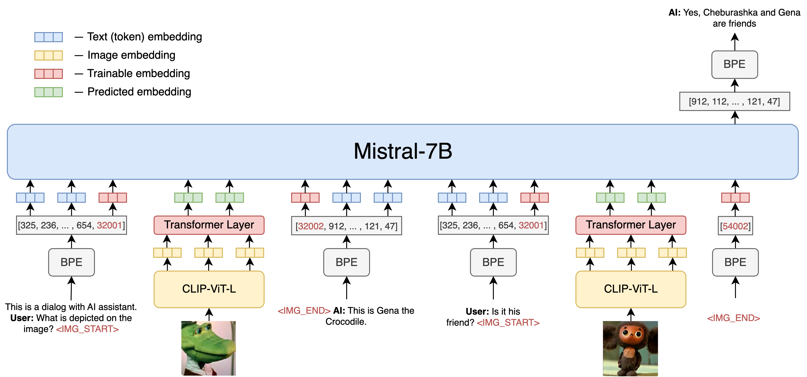

## OmniFusion

### Architecture

OmniFusion's core is the latest GigaChat-7B. Initially focusing on images, we selected the CLIP-ViT-L as the visual encoder for its efficient information transfer capabilities.

### Training Process

Unfreezing the language model is a risky process due to potential degradation in textual domain performance. Therefore, the OmniFusion training is divided into two stages:
1. Pre-training the adapter on Image Captioning tasks (LAION, CC-4M).
2. Once the adapter has learned to map ViT's visual embeddings to the language model's textual space, we proceed to unfreeze GigaChat for improved understanding of dialog formats and complex queries.

### Results

OmniFusion was benchmarked against the latest multimodal SOTA models. It excelled in generative metrics and classification benchmarks like VisualDialog.

#### Table 1 - Comparative Model Performance on Visual Dialog Benchmark

| Model        | NDCG | MRR  | Recall@1 | Recall@5 | Recall@10 |
| ------------ | ---- | ---- | -------- | -------- | --------- |
| OmniFusion   | 25.91| 10.78| 4.74     | 13.80    | 20.53     |
| LLaVA-13B    | 24.74| 8.91 | 2.98     | 10.80    | 18.02     |

### Examples

### Future Plans

We will soon release a public version of OmniFusion based on an open language model. Work is underway on a version that understands Russian, uses ImageBind encoders, and accepts more modalities (sound, 3D, video). Stay tuned for updates on GitHub!

### Authors

The FusionBrain scientific group from the AIRI Institute, in collaboration with scientists from Sber AI, led the model's development.

Main contributors:
+ Anton Razzhigaev: [Blog](https://t.me/abstractDL)
+ Elizaveta Goncharova
+ Matvey Mihkalchuk
+ Maxim Kurkin
+ Irina Abdullaeva
+ Andrey Kuznetsov [Blog](https://t.me/complete_ai)
+ Denis Dimitrov: [Blog](https://t.me/dendi_math_ai)
