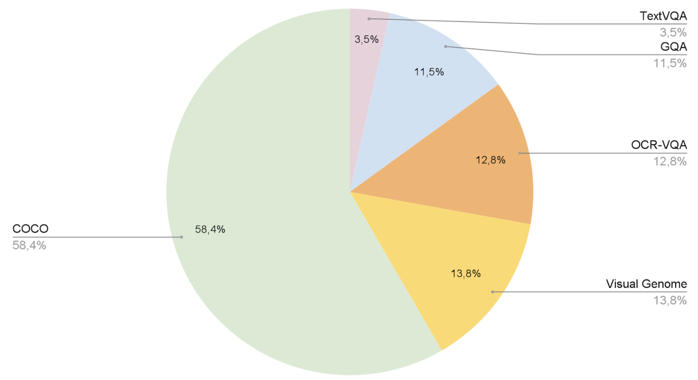

# OmniFusion

**OmniFusion** is an advanced multimodal AI model designed to extend the capabilities of traditional language processing systems by integrating additional data modalities such as images, and potentially audio, 3D and video content.

### ChangeLog
[10/04/2024] OmniFusion-1.1 weights are uploaded to [Huggingface](https://huggingface.co/AIRI-Institute/OmniFusion/tree/main/OmniMistral-v1_1). Now the model can speak Russian :)

[01/04/2024] Model training [source code](https://github.com/AIRI-Institute/OmniFusion/tree/main/OmniFusion/train_src) for OmniFusion-1.1 released

[22/11/2023] OmniFusion weights are available on [Huggingface](https://huggingface.co/AIRI-Institute/OmniFusion)

### Architecture

OmniFusion open source version core is Mistral-7B. Initially focusing on images, we selected the CLIP-ViT-L as the visual encoder for its efficient information transfer capabilities. The most important component of OmniFusion is its adapter, a mechanism allowing the language model to interpret and incorporate information from different modalities. The adapter is a single-layer, four-headed transformer, which has shown superior performance compared to simpler linear layers or MLP structures.

This adapter takes embeddings from the visual encoder (excluding the CLS token) and maps them into textual embeddings compatible with the language model.

To further enhance the model's multimodal capabilities, we employ trainable special tokens to mark the beginning and end of visual data within the text sequence.

### Training Process consists of two stages

1. Pre-training the adapter on Image Captioning tasks (LAION, CC-4M).
2. Once the adapter has learned to map ViT's visual embeddings to the language model's textual space, we proceed to unfreeze Mistral for improved understanding of dialog formats and complex queries.

### Results

OmniFusion was benchmarked against the latest multimodal SOTA models. It excelled in generative metrics and classification benchmarks like TextVQA.

OmniFusion-1.1 (GigaChat LLM) results on various benchmarks:

Omifusion-1 results:

Omifusion-1.1 (Mistral)
| Model                                  | textvqa| scienceqa  | pope      | gqa      | ok_vqa  |
| -------------------------------------- | ------ | ---------- | --------- | -------- | ------- |
| OmniFusion-1.1 (one encoder, Mistral)  | **0.4893** | **0.6802**     | 0.7818    | 0.4600   | 0.5187  |
| OmniFusion-1.1 (two encoders, Mistral) | 0.4755 | 0.6732     | **0.8153**    | **0.4761**   | **0.5317**  |

Omifusion-1 (previous version) Performance on Visual Dialog Benchmark

| Model        | NDCG | MRR  | Recall@1 | Recall@5 | Recall@10 |
| ------------ | ---- | ---- | -------- | -------- | --------- |
| OmniFusion   | 25.91| 10.78| 4.74     | 13.80    | 20.53     |
| LLaVA-13B    | 24.74| 8.91 | 2.98     | 10.80    | 18.02     |

### Examples

### OmniFusion-1.1 examples

### Future Plans

Work is underway on a version that understands Russian, uses ImageBind encoders, and accepts more modalities (sound, 3D, video). Stay tuned for updates on GitHub!

### Authors

The FusionBrain scientific group from the AIRI Institute, in collaboration with scientists from Sber AI, led the model's development.

Main contributors:
+ Anton Razzhigaev: [Blog](https://t.me/abstractDL)
+ Elizaveta Goncharova
+ Matvey Mihkalchuk
+ Maxim Kurkin
+ Irina Abdullaeva
+ Denis Dimitrov [Blog](https://t.me/dendi_math_ai)
+ Andrey Kuznetsov [Blog](https://t.me/complete_ai)
