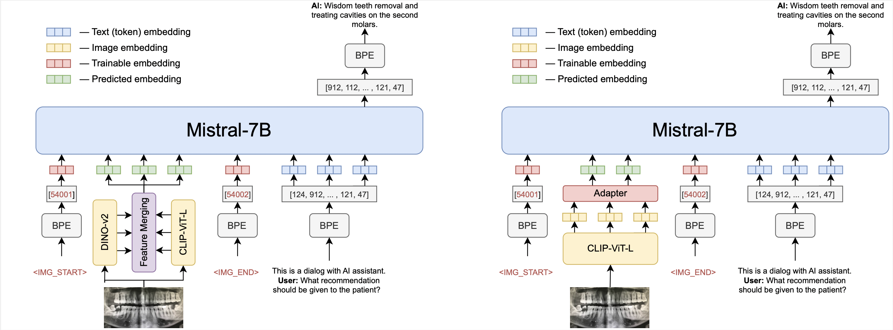

# OmniFusion

[](https://huggingface.co/AIRI-Institute/OmniFusion)

[ArXiv](https://arxiv.org/abs/2404.06212) [Project page](https://airi-institute.github.io/OmniFusion/)


**OmniFusion** is an advanced multimodal AI model designed to extend the capabilities of traditional language processing systems by integrating additional data modalities such as images, and potentially audio, 3D and video content.

### ChangeLog
[10/04/2024] OmniFusion-1.1 weights are uploaded to [Huggingface](https://huggingface.co/AIRI-Institute/OmniFusion/tree/main/OmniMistral-v1_1). Now the model can speak Russian :)

[01/04/2024] Model training [source code](https://github.com/AIRI-Institute/OmniFusion/tree/main/OmniFusion/train_src) for OmniFusion-1.1 released

[22/11/2023] OmniFusion weights are available on [Huggingface](https://huggingface.co/AIRI-Institute/OmniFusion)

### Architecture

<p align="left">

</p>


The open source OmniFusion core is Mistral-7B. There are two versions of the model: the first uses one visual encoder CLIP-ViT-L, the second uses two encoders (CLIP-ViT-L and Dino V2). Initially focusing on images, we chose CLIP-ViT-L as a visual encoder due to for its efficient information transfer capabilities.

The most important component of OmniFusion is its adapter, a mechanism that allows the language model to interpret and incorporate information from different modalities. For the single encoder version, the adapter is a single-layer four-headed transformer layer that has shown superior performance compared to simpler linear layers or MLP structures. The model with two encoders uses an adapter that collects features from all layers of visual encoders, this adapter does not have an attention layer.

The adapter takes embeddings from the visual encoder (excluding the CLS token) and maps them to textual embeddings that are compatible with the language model.

To further enhance the multimodal capabilities of the model, we use learnable custom tokens to mark the beginning and end of visual data in a text sequence.


### Training Process consists of two stages

1. Pre-training the adapter on Image Captioning tasks (LAION, CC-4M, etc.).
2. Once the adapter has learned to map visual embeddings to the language model's textual space, we proceed to unfreeze Mistral for improved understanding of dialog formats and complex queries.
3. The dataset consists of data in English and Russian and has the following structure:

| Task          | Dataset Source                     | #Samples   |
| --------------| ---------------------------------- |  --------- |
| Caption       | ShareGPT4V                         | 100K       |
| VQA           | COCO, SAM-9K                       | 20K, 9K    |
| WebQA         | WebData                            | 1.5K       |
| OCRQA         | TextVQA, OCRVQA                    | 120K       |
| Conversation  | LLaVA-v1.5-665K, OCRVQA            | 665K       |
| DocVQA        | Proprietary data (ru)              | 20K        |
| Text-only SFT | Proprietary data (ru), Alpaca (en) | 10K        |

### How to Use

```python
import torch
from PIL import Image
from transformers import AutoTokenizer, AutoModelForCausalLM
from urllib.request import urlopen
import torch.nn as nn
from huggingface_hub import hf_hub_download

# Loading some sources of the projection adapter and image encoder
hf_hub_download(repo_id="AIRI-Institute/OmniFusion", filename="models.py", local_dir='./')
from models import CLIPVisionTower

DEVICE = "cuda:0"
PROMPT = "This is a dialog with AI assistant.\n"

tokenizer = AutoTokenizer.from_pretrained("AIRI-Institute/OmniFusion", subfolder="OmniMistral-v1_1/tokenizer", use_fast=False)
model = AutoModelForCausalLM.from_pretrained("AIRI-Institute/OmniFusion", subfolder="OmniMistral-v1_1/tuned-model", torch_dtype=torch.bfloat16, device_map=DEVICE)

hf_hub_download(repo_id="AIRI-Institute/OmniFusion", filename="OmniMistral-v1_1/projection.pt", local_dir='./')
hf_hub_download(repo_id="AIRI-Institute/OmniFusion", filename="OmniMistral-v1_1/special_embeddings.pt", local_dir='./')
projection = torch.load("OmniMistral-v1_1/projection.pt", map_location=DEVICE)
special_embs = torch.load("OmniMistral-v1_1/special_embeddings.pt", map_location=DEVICE)

clip = CLIPVisionTower("openai/clip-vit-large-patch14-336")
clip.load_model()
clip = clip.to(device=DEVICE, dtype=torch.bfloat16)

def gen_answer(model, tokenizer, clip, projection, query, special_embs, image=None):
    bad_words_ids = tokenizer(["\n", "</s>", ":"], add_special_tokens=False).input_ids + [[13]]
    gen_params = {
        "do_sample": False,
        "max_new_tokens": 50,
        "early_stopping": True,
        "num_beams": 3,
        "repetition_penalty": 1.0,
        "remove_invalid_values": True,
        "eos_token_id": 2,
        "pad_token_id": 2,
        "forced_eos_token_id": 2,
        "use_cache": True,
        "no_repeat_ngram_size": 4,
        "bad_words_ids": bad_words_ids,
        "num_return_sequences": 1,
    }
    with torch.no_grad():
        image_features = clip.image_processor(image, return_tensors='pt')
        image_embedding = clip(image_features['pixel_values']).to(device=DEVICE, dtype=torch.bfloat16)

        projected_vision_embeddings = projection(image_embedding).to(device=DEVICE, dtype=torch.bfloat16)
        prompt_ids = tokenizer.encode(f"{PROMPT}", add_special_tokens=False, return_tensors="pt").to(device=DEVICE)
        question_ids = tokenizer.encode(query, add_special_tokens=False, return_tensors="pt").to(device=DEVICE)

        prompt_embeddings = model.model.embed_tokens(prompt_ids).to(torch.bfloat16)
        question_embeddings = model.model.embed_tokens(question_ids).to(torch.bfloat16)

        embeddings = torch.cat(
            [
                prompt_embeddings,
                special_embs['SOI'][None, None, ...],
                projected_vision_embeddings,
                special_embs['EOI'][None, None, ...],
                special_embs['USER'][None, None, ...],
                question_embeddings,
                special_embs['BOT'][None, None, ...]
            ],
            dim=1,
        ).to(dtype=torch.bfloat16, device=DEVICE)
        out = model.generate(inputs_embeds=embeddings, **gen_params)
    out = out[:, 1:]
    generated_texts = tokenizer.batch_decode(out)[0]
    return generated_texts

img_url = "https://i.pinimg.com/originals/32/c7/81/32c78115cb47fd4825e6907a83b7afff.jpg"
question = "What is the sky color on this image?"
img = Image.open(urlopen(img_url))

answer = gen_answer(
    model,
    tokenizer,
    clip,
    projection,
    query=question,
    special_embs=special_embs,
    image=img
)

img.show()
print(question)
print(answer)
```

### Results

OmniFusion was benchmarked against the latest multimodal SOTA models. It excelled in generative metrics and classification benchmarks like TextVQA.

OmniFusion-1.1 (GigaChat LLM) results on various benchmarks:
<p align="left">

</p>

Omifusion-1.0 results:
<p align="left">

</p>

Omifusion-1.1 (Mistral)
| Model                                  | textvqa| scienceqa  | pope      | gqa      | ok_vqa  |
| -------------------------------------- | ------ | ---------- | --------- | -------- | ------- |
| OmniFusion-1.1 (one encoder, Mistral)  | **0.4893** | **0.6802**     | 0.7818    | 0.4600   | 0.5187  |
| OmniFusion-1.1 (two encoders, Mistral) | 0.4755 | 0.6732     | **0.8153**    | **0.4761**   | **0.5317**  |

Omifusion-1.0 (previous version) Performance on Visual Dialog Benchmark

| Model        | NDCG | MRR  | Recall@1 | Recall@5 | Recall@10 |
| ------------ | ---- | ---- | -------- | -------- | --------- |
| OmniFusion   | 25.91| 10.78| 4.74     | 13.80    | 20.53     |
| LLaVA-13B    | 24.74| 8.91 | 2.98     | 10.80    | 18.02     |


### OmniFusion-1.1 examples
<p align="left">

</p>
<p align="left">

</p>

### OmniFusion-1.0 Examples
<p align="left">

</p>

### Future Plans

Work is underway on a version that understands Russian, uses ImageBind encoders, and accepts more modalities (sound, 3D, video). Stay tuned for updates on GitHub!

### Authors

The FusionBrain scientific group from the AIRI Institute, in collaboration with scientists from Sber AI, led the model's development.

Main contributors:
+ Anton Razzhigaev: [Blog](https://t.me/abstractDL)
+ Elizaveta Goncharova
+ Matvey Mihkalchuk
+ Maxim Kurkin
+ Irina Abdullaeva
+ Denis Dimitrov [Blog](https://t.me/dendi_math_ai)
+ Andrey Kuznetsov [Blog](https://t.me/complete_ai)
